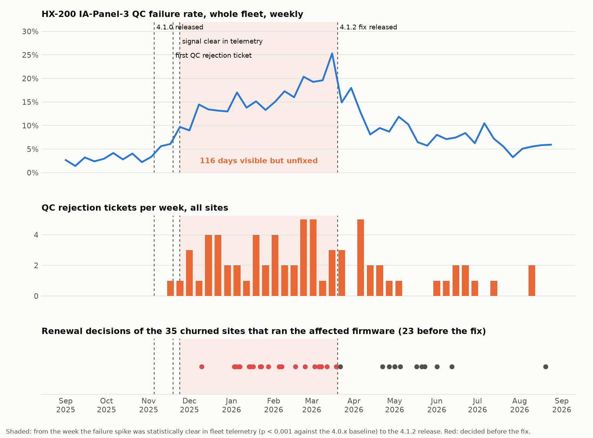
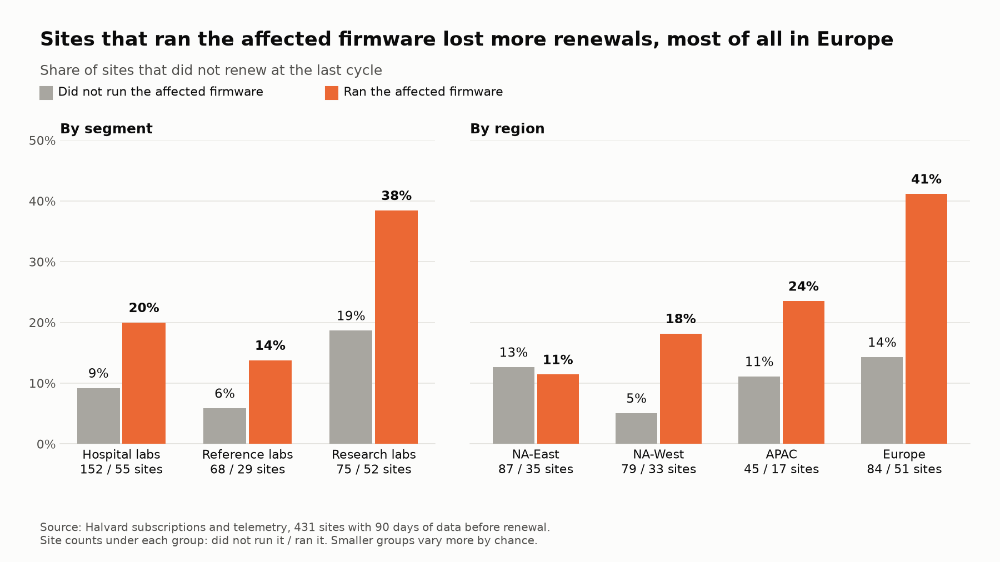

# Findings: QC failures and churn

**For:** Dana Whitfield · **Data:** 2025-09-01 to 2026-08-31 · **Sites:** 431

As your team suspected, QC failures above the normal rate went with the lost renewals, and they came from one defect, the IA-Panel-3 curve-fit problem that Halvard corrected in 4.1.2. On the HX-200, IA-Panel-3 on other firmware failed QC on about 3% of runs a week and never above 5.1% in 53 weeks, so the upper limit of its normal range is 6.2%, three standard deviations up. All 35 weeks on 4.1.0 and 4.1.1 were above it, at 38% on average. Each instrument's failures started when it installed 4.1.0 and stopped when it installed 4.1.2, whatever the date, so a bad control lot doesn't explain them. The rate went from 27% to 4% after the upgrade.

## What it cost

A site runs a median of 6 QC runs per assay in 90 days, too few to set a range for each site, so sites are compared by whether they ran the affected combination. Sites that ran it churned at 25.7%, more than twice the normal rate of about 11% a year. The difference holds with region, segment, tier and run volume held equal, at 2.3 times the odds (p = 0.005). That's about 20 more lost sites than normal (15 to 24 across the range for normal churn), worth $94,000 to $156,000 in ARR. Five of the nine sites now on notice ran it too.

## Visible early, fixed late

Users filed the first QC rejection ticket 14 days after 4.1.0 shipped, and all 71 came from sites that ran the affected firmware. Halvard's telemetry showed the problem clearly 19 days after release. 4.1.2 shipped 116 days after that, and 49 HX-200s still listed 4.1.0 at the extract date. Of the 35 churned sites that ran the affected firmware, 23 decided before the fix existed.

## Europe

*Research labs that ran the affected firmware churned at 38%, against 19% for those that didn't. Most of the difference is in Europe, at 74% (14 of 19) against 22% (4 of 18), and it holds after correcting for the 12 groups checked (p = 0.035). Direct research labs churned at 18% either way.*

European sites that ran the affected firmware churned at 41%, against 16% for direct sites (p = 0.002). European QC rejection tickets waited 22.8 hours for a first response, against 6.2. We need more data to say whether the slower response caused the churn, because churned sites that filed a QC ticket didn't wait longer.

## Should QC alerting be a Plus feature?

A QC failure from Halvard's firmware is Halvard's defect to catch, so QC alerting belongs in every tier. A Plus-only alert would have reached 7 of the 35 lost sites, and those labs already saw the failures on the instrument, so as a Plus feature its value at renewal is close to zero. Only five of the 35 filed a QC rejection ticket before deciding. **The gap was between a clear signal in Halvard's telemetry and a fix in the field.**

Release testing is the other gap. The defect appeared only on the HX-200. The HX-200 Plus ran IA-Panel-3 at about 4% on the same firmware, and the 37 Plus sites that ran it churned at 10.8%, consistent with no effect, though too few to rule out a moderate one. PROPOSAL.md starts with the affected sites still due to renew.

With one renewal cycle, normal churn of 11% is an estimate, likely 8% to 15%.
